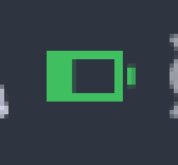
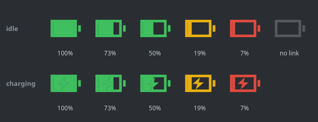

# mousebat

A tray indicator for Logitech wireless mouse battery level, for KDE Plasma.

The kernel creates no `power_supply` entry for mice paired to a Logi Bolt receiver,
so Plasma's stock "Battery and Brightness" widget cannot show them. `mousebat` reads
the charge itself — over HID++ 2.0 through the receiver's `/dev/hidraw` node — and
draws an icon in the tray.

Read-only: nothing is ever written to the mouse, so a
[logiops](https://github.com/PixlOne/logiops) configuration (`/etc/logid.cfg`) stays
untouched. It coexists with a running `logid`, telling its own replies apart by
`software_id`.



*In the Plasma panel (magnified 6×).*



## What it shows

- A battery icon filled in proportion to the charge: green from 20% up, amber below
  20%, red below 10%.
- A lightning bolt while charging, sitting in its own gap in the fill so it stays
  legible at any level. The battery body itself is never broken by it.
- Tooltip: the device name and `73% — discharging`.
- Lost link (mouse asleep, receiver unplugged): the icon dims and the tooltip reads
  `no connection`. Recovery is picked up automatically.
- Right-click menu: Refresh, Start at login, Quit.
- The tray item is named after the device, so Plasma's collapsed-items list reads
  `MX Master 3S` rather than `mousebat`.

Polling runs every 5 minutes, or every minute while the link is down.

No device is hard-coded: the first pointing device on any Logitech receiver is used.

## Requirements

- Linux with systemd and a tray that speaks StatusNotifierItem (KDE Plasma does).
- Python 3.11+ and PyQt6 — the installer pulls `python3-pyqt6` on Debian/Ubuntu.
- A Logitech receiver speaking HID++ 2.0: Logi Bolt and Unifying both work.

Developed and verified on Debian 13 with Plasma 6 on Wayland, against an MX Master 3S
on a Logi Bolt receiver and an MX Keys on Unifying.

## Install

```sh
./install.sh
```

That is all: it installs `python3-pyqt6` if missing, the udev rule, the systemd user
unit, then starts the applet and enables autostart. Only the udev rule needs `sudo`,
and the script asks for it at that point — do not run the whole thing as root.

```sh
./install.sh --no-autostart   # install and run now, but do not start at login
./install.sh --uninstall      # remove the unit and the udev rule
./install.sh --help
```

The project may live anywhere: the installer substitutes its actual path into the unit.

The udev rule tags Logitech hidraw nodes with `uaccess`, granting access to the user
of the active local session — no groups, no root daemon.

Logs: `journalctl --user -u mousebat -f`

## Autostart

Toggle it from the tray menu: **Start at login**. The checkmark reflects the systemd
unit itself, so it stays truthful even if you change things from a terminal:

```sh
systemctl --user enable mousebat.service
systemctl --user disable mousebat.service
```

The menu entry is hidden when no unit is installed — for instance when the applet was
started by hand with `python3 -m mousebat`.

## Diagnostics

```sh
python3 tools/spike_probe.py
```

Prints every HID++ node found, the replies for indices 1–6, device names and types,
battery feature indices and the raw bytes of the charge reply. Start here if the icon
says `no connection`.

Regenerate the contact sheet at the top of this file:

```sh
QT_QPA_PLATFORM=offscreen python3 tools/preview_icon.py
```

It writes `docs/images/icon-states.png` straight from the rendering code, so the
documentation cannot drift away from what the applet actually draws. Pass a path to
write somewhere else.

## Tests

```sh
python3 -m pytest
```

No hardware required: the transport is replaced by recorded bytes and `/sys` by a
temporary directory. Icon tests are skipped when PyQt6 is not installed.

## Layout

| Module | Responsibility |
|---|---|
| `mousebat/hidpp.py` | HID++ packets, filtering foreign replies, both error schemes |
| `mousebat/discovery.py` | finding HID++ nodes and the mice behind them |
| `mousebat/battery.py` | charge via feature `0x1004`, falling back to `0x1000` |
| `mousebat/icon.py` | icon rendering |
| `mousebat/tray.py` | icon, menu, polling on a worker thread |
| `mousebat/autostart.py` | reads and flips the unit's enablement |

Polling lives on its own thread: with the link lost, walking receivers and indices
takes seconds, which would freeze the interface on the main thread.

Qt freezes a tray item's title when the item is created, and re-creating the item makes
it disappear from the tray for good — both verified against Plasma. So the icon is
created only after the first poll has named the mouse, and swapping in a different
mouse needs `systemctl --user restart mousebat.service` for the new name to show.

Design notes: [`docs/superpowers/specs/2026-07-31-mouse-battery-tray-design.md`](docs/superpowers/specs/2026-07-31-mouse-battery-tray-design.md)

## License

MIT — see [LICENSE](LICENSE).
